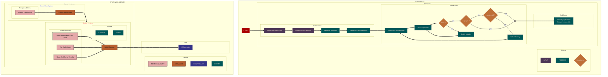

<h2>🎮 AutoBattler Game  📚 C++ Study Project </h2>

<h3>Study Requirements:</h3>

- Avoid using heap allocations.

<h3>Diagrams:</h3>

[mermaid_diagram.txt](mermaid_diagram.txt)

```mermaid
flowchart TD
    subgraph appFlow [ FLOWCHART ]
    
        subgraph Legend [Legend]
            input[INPUT]:::input
            process[PROCESS]:::process
            conditional{Conditional}:::conditional
        end
        
        start(START):::start -->| | inputName
        
        subgraph flowChart [Flowchart]
            subgraph battleSetup [Battle Setup]
                inputName[Read Character Name]:::input-->
                inputEnemies[Read Enemies amount]:::input -->
                generateEnemies[Generate enemies]:::process --> randomizeStats
                randomizeStats[Randomize enemies stats]:::process
            end
            
            randomizeStats -->| | randomizeAttacker
            
            subgraph battleLoop [Battle Loop]
                selectEnemy[Select Enemy]:::process --> randomizeAttacker
                randomizeAttacker[Randomize turn attacker]:::process --> attack
                switchAttacker[Switch attacker]:::process --> attack
                attack[Attack opponent]:::process --> testsDie
                testsDie{Died ?}:::conditional 
                    testsDie -.->|yes| checkPlayerDead
                    testsDie -.->|no| switchAttacker        
                checkPlayerDead{Is player ?}:::conditional 
                    checkPlayerDead -.->|no| testsEnemiesLeft   
                    checkPlayerDead -.->|yes| endGame     
                testsEnemiesLeft{enemies left ?}:::conditional
                    testsEnemiesLeft -.->|no| endGame
                    testsEnemiesLeft -.->|yes| selectEnemy
                endGame(( )):::connector    
            end

            endGame ==>| | showIfPlayerDead

            subgraph endGameGraph [End Game]
                showIfPlayerDead[Show if player dead \n Show enemies data]:::process
            end
        end
    end

    subgraph arquitecture [SYSTEMS DIAGRAM]

        subgraph arquitectureLegend [Legend]
            responsabilityLegend[RESPONSABILITY]:::responsability
            managerLegend[MANAGER]:::manager
            controllerLegend[CONTROLLER]:::controller
            entityLegend[ENTITY]:::entity
        end
        
        subgraph utils [Utils]
            IOController[IOController]:::controller
        end

        subgraph gameSystems [Game Systems]
            style gameSystems color:#bbbbbb
            subgraph gameFlowSystem [Game Flow System]
                style gameFlowSystem color:#8888ff
                subgraph gameFlowSystemResponsabilities [Responsabilities]
                    controlGameState[Control Game State]:::responsability
                end
                controlGameState --> gameFlowManager
                gameFlowManager[GameFlowManager]:::manager                
            end
            gameFlowManager --> battleSystem
            subgraph battleSystem [Battle System]
                style battleSystem color:#f66
                subgraph battleSystemResponsabilities [Responsabilities]
                    readBattleSetupFromUser[Read Battle Setup From User]:::responsability 
                    runBattleLoop[Run Battle Loop]:::responsability
                    showEndGameResults[Show End Game Results]:::responsability
                end
                readBattleSetupFromUser --> battleManager
                runBattleLoop --> battleManager
                showEndGameResults --> battleManager
                
                battleManager[BattleManager]:::manager
                    battleManager --> IOController                

                subgraph entities [Entities]
                    characterEntity[Character]:::entity
                    enemyEntity[Enemy]:::entity
                end
            end
        end
    end

    classDef start fill:#aa0000,color:#ebd4cb,stroke:#ebd4cb,stroke-width:1px;
    classDef input fill:#4c3655,color:#ebd4cb,stroke:#ebd4cb,stroke-width:1px;
    classDef process fill:#005858,color:#ebd4cb,stroke:#ebd4cb,stroke-width:1px;
    classDef conditional fill:#be6f37,color:#ebd4cb,stroke:#ebd4cb,stroke-width:1px;
    classDef connector fill:#333333,color:#ebd4cb,stroke:#ebd4cb,stroke-width:1px;
    
    classDef controller fill:#333388,color:#ebd4cb,stroke:#ebd4cb,stroke-width:1px;
    classDef responsability fill:#e5a9a9,color:#111111,stroke:#111111,stroke-width:1px;
    classDef manager fill:#b85f2f,color:#111111,stroke:#111111,stroke-width:1px;
    classDef entity fill:#005858,color:#ebd4cb,stroke:#ebd4cb,stroke-width:1px;
    
    linkStyle default stroke:#333333,stroke-width:4px;
```
